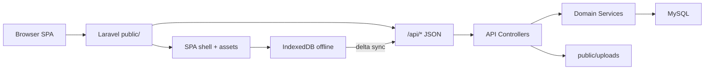

# Migrate OpenPOS Backend to Laravel + MySQL

**Goal:** Reuse the existing React/Vite frontend; replace the Go + PostgreSQL backend with Laravel (PHP) + MySQL for shared-hosting deployment.

**Decisions locked**
- **1A — Same origin:** Laravel serves API + built SPA from `public/` (one document root).
- **2C — Laravel as repo root:** Standard Laravel layout; Vite app lives in `frontend/`; Go moves to `_legacy/`.

---

## Architecture



**Shared-host constraints**
- PHP 8.2+ (Laravel 11), MySQL 8 or MariaDB 10.6+
- Document root = `public/`
- No queues/WebSockets required (Go has none today)
- Uploads under `public/uploads` (avoid `storage:link`)
- Deploy `vendor/` from local/CI if host has no Composer
- Apache `.htaccess` rewrite to `index.php`

---

## Non-negotiable domain rules (unchanged)

1. Product → Variant (never flat products)
2. Inventory ledger only; stock = `SUM(quantity_change)`
3. Offline delta sync + client UUID idempotency
4. Money as integers (satang/`BIGINT`)
5. Sale-time price/cost snapshots on order items

---

## Phase 0 — Freeze the frontend API contract

Source of truth = **frontend call sites**, not Go (paths already drift).

Extract a checklist from:
- [`frontend/src/lib/api.ts`](../../frontend/src/lib/api.ts)
- [`frontend/src/lib/erp-api.ts`](../../frontend/src/lib/erp-api.ts)
- [`frontend/src/lib/users-api.ts`](../../frontend/src/lib/users-api.ts)
- [`frontend/src/lib/reporting-api.ts`](../../frontend/src/lib/reporting-api.ts)
- [`frontend/src/pos/hooks/useSync.ts`](../../frontend/src/pos/hooks/useSync.ts)

### Endpoint map (FE → Laravel must match)

| Method | Path | Envelope notes |
|--------|------|----------------|
| POST | `/api/auth/login` | `{ user, token }` |
| POST | `/api/auth/login/pin` | `{ user, token }` |
| POST | `/api/auth/register` | user object (FE then logs in) |
| GET/POST/PUT | `/api/catalog/categories`… | `{ data: … }` |
| PUT | `/api/catalog/categories/reorder` | `{ data: null }` |
| GET/POST/PUT | `/api/catalog/products`… | `{ data: … }` |
| POST | `/api/catalog/import` | `{ data: … }` |
| POST | `/api/catalog/images` | `{ url }` (multipart `image`) |
| POST/PUT | variants under products | `{ data: … }` |
| GET | `/api/catalog/variants/search?q=` | `{ data: … }` |
| POST | `/api/inventory/adjust` | `{ data: LedgerEntry }` |
| GET | `/api/inventory/variants/{id}/stock` | `{ data: { variant_id, stock_level } }` |
| GET | `/api/inventory/variants/{id}/ledger` | `{ data: […] }` |
| POST | `/api/inventory/sync` | batch result `{ data: { processed, … } }` |
| POST | `/api/orders` | `{ data: Order }` |
| POST | `/api/orders/sync` | offline batch + optional payment |
| POST | `/api/orders/{id}/payments` | `{ data: Receipt }` |
| GET | `/api/orders/{id}/receipt` | `{ data: Receipt }` |
| GET/POST/PUT | `/api/users` | **raw** array/object (no `{ data }`) |
| PATCH | `/api/users/{id}/toggle-active` | raw user |
| GET | `/api/reports/monthly-sales` | `{ data: […] }` |
| GET | `/api/reports/gross-profit` | `{ data: […] }` |

### Auth contract

- `Authorization: Bearer <JWT>`
- HS256, claims include `user_id`, `email`, `role`, `exp` (~24h)
- Roles: preserve exact strings FE expects (`owner` / `cashier` — verify against live Go responses during freeze)
- bcrypt password/PIN hashes
- No refresh tokens

### FE quirks to preserve

- Mixed envelopes (`{ data }`, raw users, `{ user, token }`, `{ url }`)
- Integer money; UUID strings
- Variant nested field `stockLevel` (camelCase) vs inventory endpoint `stock_level`
- Errors often `{ error: string }`

**Out:** Do not adopt Laravel Sanctum cookie sessions or default pagination wrappers.

---

## Phase 1 — Repo restructure (Laravel root)

1. Scaffold Laravel 11 at repository root.
2. Keep SPA in `frontend/` (Vite + React).
3. Move Go tree to `_legacy/go/` (`cmd/`, `internal/`, `db/`, `go.mod`, etc.) for reference until cutover.
4. Vite build config:
   - `base: '/'`
   - Emit assets to `public/build` (or similar)
   - **Never overwrite** `public/index.php`
5. Laravel routes:
   - `routes/api.php` → `/api/*`
   - Catch-all GET (non-file, non-api) → SPA shell view that loads Vite build
6. FE change (minimal): default `VITE_API_URL` / `VITE_API_URL` to `''` (same origin).
7. Replace Postgres in Docker Compose with MySQL 8; update README/DEPLOYMENT.

Suggested layout after restructure:

```
/
├── app/ Http/ Models/ Services/
├── bootstrap/
├── config/
├── database/migrations/
├── frontend/          # existing Vite SPA
├── public/            # docroot: index.php + build + uploads
├── routes/api.php
├── _legacy/go/        # archived Go backend
├── composer.json
└── docker-compose.yml
```

---

## Phase 2 — MySQL schema

Port [`db/migrations/`](../../db/migrations/) via Laravel migrations.

| Postgres | MySQL |
|----------|-------|
| `UUID` | `CHAR(36)`, app-generated `Str::uuid()` |
| `TIMESTAMPTZ` | `TIMESTAMP` (store/compare in UTC) |
| `BOOLEAN` | `TINYINT(1)` |
| money `BIGINT` | `BIGINT` |
| `ON CONFLICT DO NOTHING` | unique + `insertOrIgnore` / catch duplicate |
| views + `DATE_TRUNC`/`TO_CHAR` | views + `DATE_FORMAT(..., '%Y-%m')` |

Tables: `users`, `categories`, `products`, `variants`, `inventory_ledger`, `orders`, `order_items`, `payments`, plus reporting views.

Must include: `orders.client_uuid` unique, ledger client ids for sync idempotency, `order_items` price/cost snapshots, order discount column, category `sort_order`, user `is_active` / PIN hash.

---

## Phase 3 — API implementation order

```
app/Http/Controllers/Api/{Auth,Catalog,Inventory,Orders,Users,Reports}/
app/Services/{AuthService,CatalogService,InventoryService,SalesService,ReportingService}/
app/Http/Middleware/{AuthenticateJwt,EnsureOwner}/
app/Models/...
```

| Step | Domain | Why this order |
|------|--------|----------------|
| 1 | Auth + Users + JWT middleware | Unblocks all protected routes |
| 2 | Catalog (+ image upload) | POS/ERP browse & manage |
| 3 | Inventory ledger/adjust/sync | Stock reads + offline adjust |
| 4 | Orders/payments/receipts/sync | Sales TX + stock deduct |
| 5 | Reports | Read models last |

Use DB transactions for: create order + ledger SALE rows; payment completion; sync batches with per-item idempotency.

Thin transformers/API Resources must emit **exact** FE shapes (including inconsistent envelopes).

---

## Phase 4 — Local + shared-host packaging

**Local**
- Compose: MySQL + app (or `artisan serve`)
- `php artisan migrate --seed`
- `pnpm --dir frontend dev` with API URL pointing at Laravel (or Vite proxy)

**Shared host**
- Build: `composer install --no-dev -o` + `pnpm --dir frontend build`
- Docroot → `public/`
- Writable: `storage/`, `bootstrap/cache/`, `public/uploads/`
- `.env`: `APP_KEY`, `DB_*`, `JWT_SECRET`, `APP_URL`
- Apache `public/.htaccess` (Laravel default)
- PHP ext: `pdo_mysql`, `mbstring`, `openssl`, `fileinfo`, `tokenizer`, `xml`, `ctype`, `json`, `bcmath`

---

## Phase 5 — Verify and cut over

1. Pest/PHPUnit contract tests per endpoint group (golden JSON fixtures from Phase 0).
2. Run FE Vitest; manual smoke: login, catalog, sale, receipt, offline order sync, inventory adjust sync, reports, image upload.
3. Optional one-shot data migrate Postgres → MySQL if production data exists.
4. Point docs/CI at Laravel; keep `_legacy/go` until stable, then delete in a later cleanup.

---

## Frontend scope (minimal)

- Same-origin base URL
- Vite outDir / SPA shell cooperation with Laravel
- **No** UI rewrite, Dexie redesign, or sync protocol change

---

## Risks

| Risk | Mitigation |
|------|------------|
| Go ↔ FE path/envelope drift | Freeze on FE; Laravel matches FE |
| Host PHP &lt; 8.2 | Confirm before build; blockers early |
| MariaDB SQL differences | Run reporting migrations on target engine in Phase 2 |
| Vite clobbering `public/index.php` | Build into `public/build`; Blade/SPA shell references manifest |
| JWT/role string mismatch | Capture live token + `/api/users` payloads in Phase 0 |

---

## Out of scope

- React POS/ERP redesign
- Sanctum session auth
- Queues, Reverb, multi-tenancy
- Decimal money or mutable stock quantity column

---

## Implementation todos

1. [ ] Phase 0: Contract checklist + JWT/role freeze
2. [ ] Phase 1: Laravel root scaffold + legacy Go move + SPA wiring
3. [ ] Phase 2: MySQL migrations/models/views
4. [ ] Phase 3: API domains Auth → Reports
5. [ ] Phase 4: Docker MySQL + shared-host deploy docs/script
6. [ ] Phase 5: Contract tests, FE smoke, cutover
